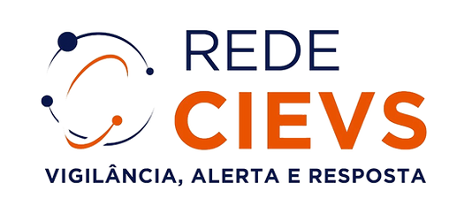
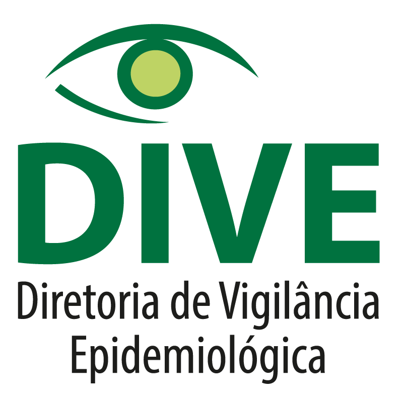

<div style = 'float: right; '>


</div>


<br>


# Sobre nós

O Centro de Informações Estratégicas em Vigilância em Saúde de Santa Catarina (CIEVS-SC) é uma estrutura estratégica do SUS dedicada à detecção, verificação, avaliação e resposta a eventos de importância em saúde pública. Atuamos de forma integrada com a rede nacional (Rede CIEVS) e internacional de vigilância, fortalecendo a capacidade de resposta rápida a emergências epidemiológicas no Brasil.

> Núcleo de dados CIEVS/SC

Criado em 2021 no cerne da crise do COVID-19, o núcleo de dados do CIEVS/SC atua no âmbito da inteligência epidemiológica, com a análise e integração de bases de dados para gerar alertas e relatórios estratégicos, além do desenvolvimento de dashboards, uso de estatística aplicada e de ferramentas analíticas para apoio à decisão.

## Sobre o repositório

Este repositório contém algumas das aplicações desenvolvidas pelo núcleo de dados do CIEVS/SC, utilizando como framework o R e o Shiny, e criadas para simplificar a visualização e análise de dados. Os aplicativos possuem uma interface intuitiva, widgets personalizáveis e atualizações contínuas. O repositório inclui código documentado, com instruções de instalação e um conjunto de dados de exemplo, garantindo uma configuração e a personalização fáceis. 

🚀 Como usar?
1. Instalação dos pacotes necessários
Com o  R (≥ 4.0) instalado, rodar os seguintes códigos:

```{r}
install.packages("shiny")
install.packages("devtools")
```

2. Rodar a aplicação

```{r}
shiny::runGitHub("cievssc", "[nome_do_repositório]")
```

Ou localmente:

```{r}
shiny::runApp("[/diretório_dos_arquivos]")
```

## 📌 Aplicações desenvolvidas
1. Painel dengue
2. Vigipass  
   - Formulários  
   - Painel
3. DDA  
4. Sinasc e anomalias congênitas 


### Direitos de uso

Acreditamos que a ciência aberta é importante, por isso nossas aplicações são públicas e disponíveis no GitHub.

Elas são gratuitas, *open-source* e licenciadas sob os termos [GNU General Public License v2.0 (GPL-2)](./LICENSE.md). Em síntese, podemos afirmar que as aplicações disponibilizadas aqui:

- Podem ser usadas para propósitos comerciais e privados;
- Não podem ser patenteadas;
- Podem ser modificadas, mas ressalta-se que estas versões devam ser licenciadas sob os mesmos termos utilizadas aqui e que o CIEVS/SC seja citado;
- A responsabilidade e a garantia de uso é inteira do usuário.
